# Your-Deep-Learning-Basic-Models

用 PyTorch 从零复现四个经典神经网络，覆盖图像与文本两大方向，作为深度学习入门练手项目。

| 模型   | 数据集   | 任务          | 我的最佳测试准确率 |
| ------ | -------- | ------------- | ------------------ |
| MLP    | MNIST    | 手写数字分类  | **98.36%**         |
| CNN    | CIFAR10  | 图像分类      | **83.88%**         |
| ResNet | CIFAR10  | 图像分类      | **83.40%**         |
| Bi-GRU | IMDB     | 情感二分类    | **89.08%**         |

## 项目结构

```
Your-Deep-Learning-Basic-Models/
├── README.md
├── requirements.txt
├── assets/                # 所有训练曲线 + 模型结构示意图
├── models/                # 四个模型各自独立
│   ├── mlp.py
│   ├── cnn.py
│   ├── gru.py
│   └── resnet.py
├── data_utils.py          # 数据加载（MNIST / CIFAR10 / IMDB）
├── plot_structures.py     # 生成 4 张模型结构示意图
├── train.py               # 统一训练 / 测试 / 画曲线主程序
└── data/                  # 自动下载的数据集，不需要手动准备
```

## 环境

已在 Python 3.10 + PyTorch 2.x 下测试。

```bash
pip install -r requirements.txt
```

## 快速开始

```bash
# 只训练某一个模型
python train.py --model mlp
python train.py --model cnn     --epochs 30
python train.py --model resnet  --epochs 30
python train.py --model gru     --epochs 8

# 一键训练全部
python train.py --model all

# 生成 4 张模型结构示意图（不需要训练）
python plot_structures.py
```

默认参数下：
- **MLP**：10 epoch，Adam，lr=1e-3，batch=128
- **CNN / ResNet**：30 epoch，Adam + 余弦退火，weight_decay=5e-4，batch=128，CIFAR10 使用随机裁剪 + 水平翻转
- **Bi-GRU**：8 epoch，Adam，lr=1e-3，batch=64，序列最长 256 token

训练结束后 `assets/` 下会生成 4 张曲线图（以 MLP 为例）：

- `assets/mlp_train_loss.png`
- `assets/mlp_train_acc.png`
- `assets/mlp_test_loss.png`
- `assets/mlp_test_acc.png`

四个模型一共 16 张曲线 + 4 张结构示意图。

---

## 1. MLP on MNIST

**结构**：两层隐藏层的全连接网络。

- 展平: 1×28×28 → 784
- Linear(784, 256) + ReLU + Dropout(0.2)
- Linear(256, 128) + ReLU + Dropout(0.2)
- Linear(128, 10)

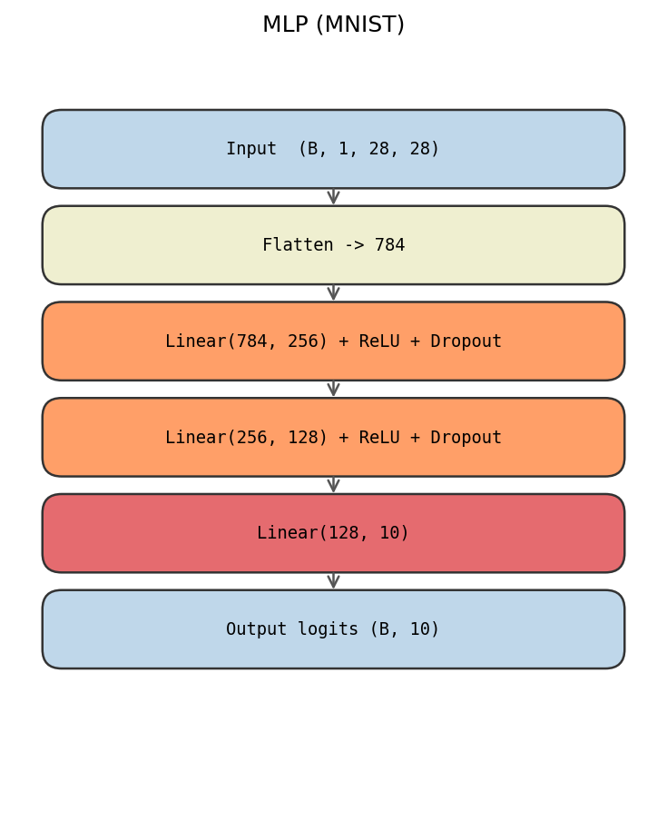

训练曲线：

| 训练集 Loss | 训练集 Acc |
| --- | --- |
| 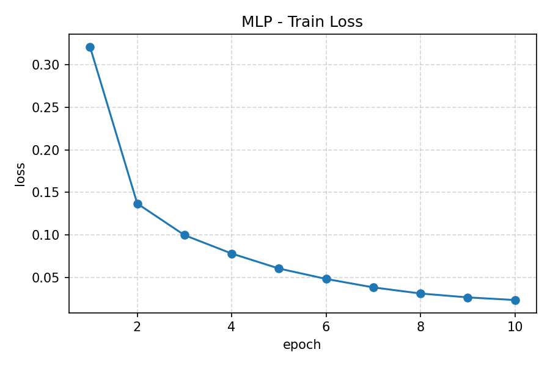 |  |

| 测试集 Loss | 测试集 Acc |
| --- | --- |
|  |  |

---

## 2. CNN on CIFAR10

**结构**：3 个 block，每个 block 两层 3×3 卷积（padding=1，BN+ReLU），通道 16→16→32→32→64→64，block 之间只用 `MaxPool(2,2)` 下采样，尾部 `AdaptiveAvgPool` + `Linear(64, 10)`。

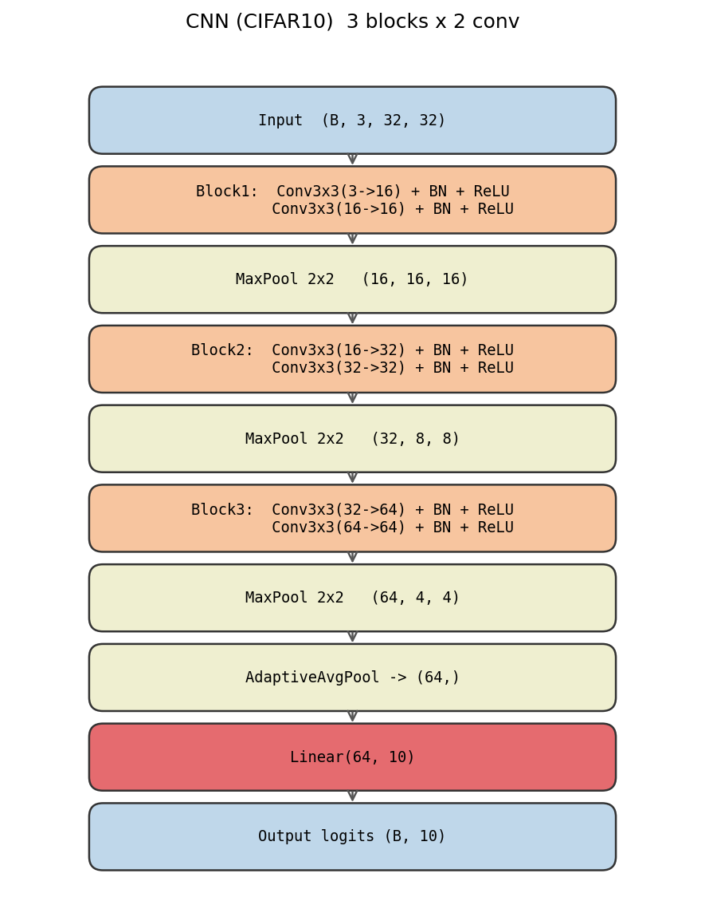

| 训练集 Loss | 训练集 Acc |
| --- | --- |
| 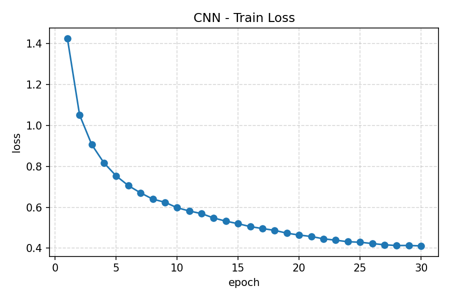 |  |

| 测试集 Loss | 测试集 Acc |
| --- | --- |
|  |  |

---

## 3. ResNet on CIFAR10

在上面的 CNN 基础上，把每个 block 里的两层普通卷积整体换成一个 **BasicBlock**（两层 3×3 卷积 + 残差连接；通道变化时 shortcut 用 1×1 卷积对齐）。下采样仍然使用 MaxPool。

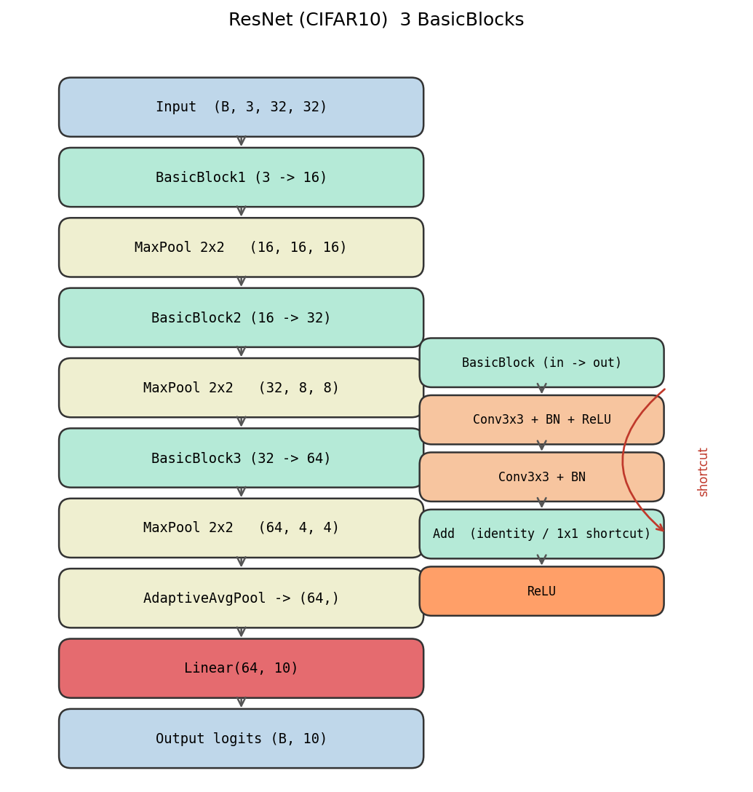

| 训练集 Loss | 训练集 Acc |
| --- | --- |
|  | 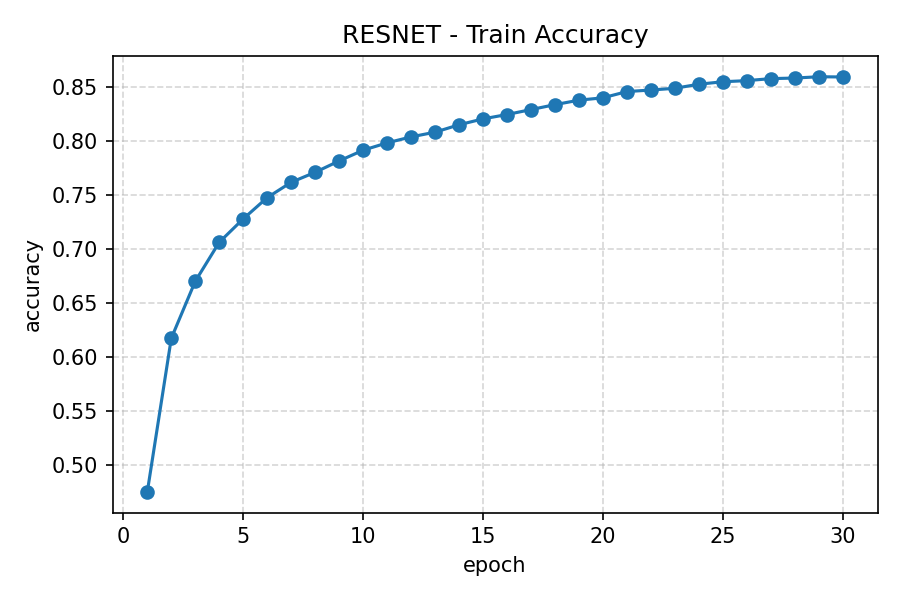 |

| 测试集 Loss | 测试集 Acc |
| --- | --- |
| 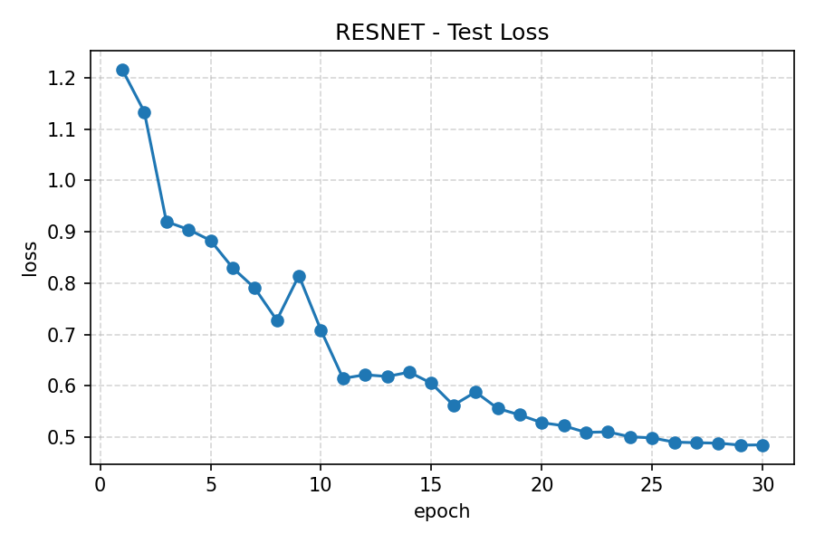 |  |

---

## 4. Bi-GRU on IMDB

**结构**：词嵌入 128 维 → 2 层双向 GRU（hidden=128）→ 取最后一层正向/反向末时刻隐藏态拼接 (256 维) → Dropout → Linear(256, 2)。

- 数据集：Stanford IMDB 25000 训练 / 25000 测试，代码首次运行会自动下载并解压到 `data/aclImdb/`。
- 分词：小写化 + 正则切分 `[A-Za-z']+`，去除 `<br />`；词表按训练集词频保留 top 20000，padding 用索引 0。
- 序列最长截断到 256 token，`pack_padded_sequence` 处理变长。

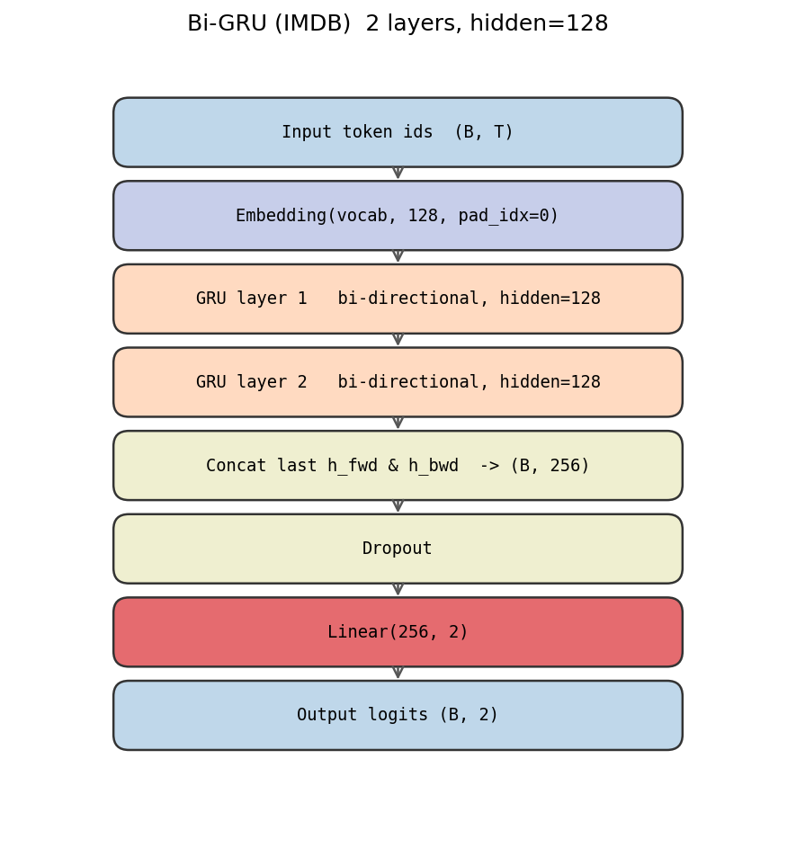

| 训练集 Loss | 训练集 Acc |
| --- | --- |
| 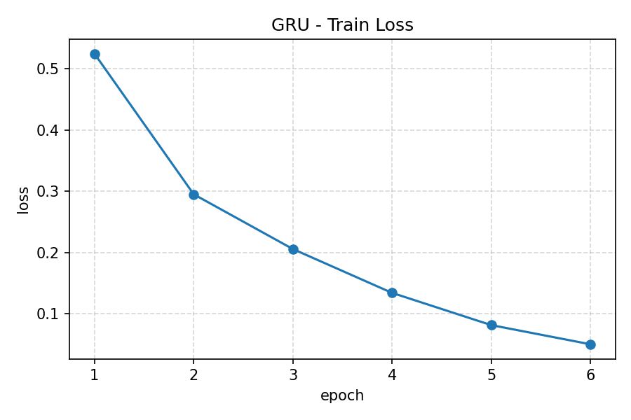 | 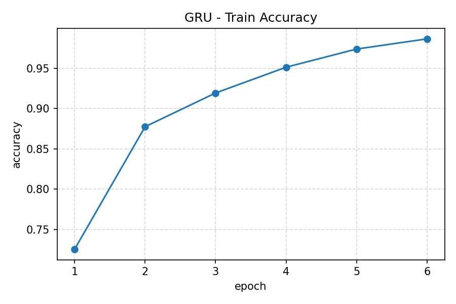 |

| 测试集 Loss | 测试集 Acc |
| --- | --- |
| 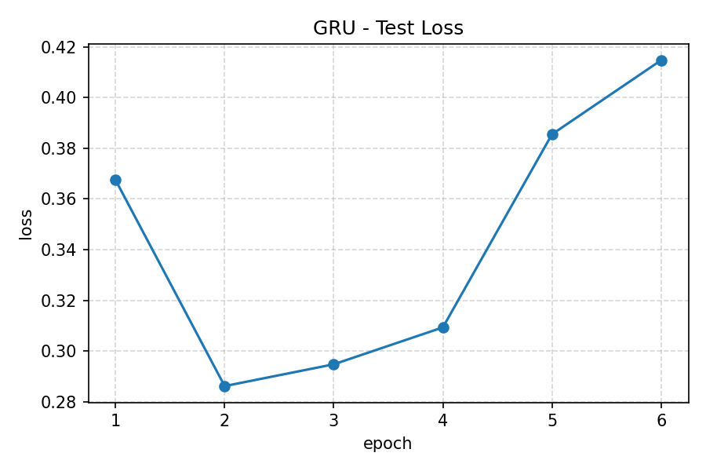 | 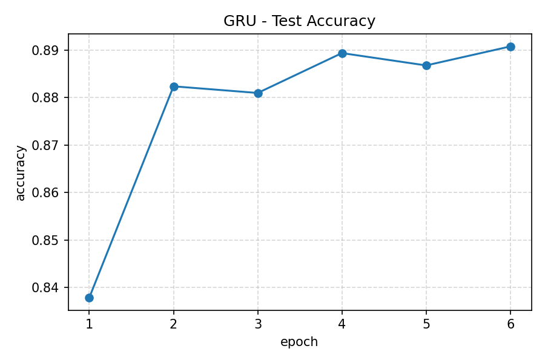 |

---

## 一些实验体会

- MLP 在 MNIST 上即使只有两层也能达到 97% 以上，但它把图像展平以后完全丢失了空间结构，在 CIFAR10 这种自然图像上就很吃力。
- 普通 6 层 CNN 在 CIFAR10 上收敛比 MLP 快很多，但继续加深会出现训练 loss 先降后升的情况。
- 加入残差连接后，ResNet 版本在相同深度下通常收敛更稳、测试准确率更高，直观验证了残差的作用。
- Bi-GRU 在 IMDB 上比单向 GRU 稳一些；序列长度截断太短会丢语义，太长又训练慢，取 256 是一个比较平衡的点。

## 参考

- Kaiming He et al., *Deep Residual Learning for Image Recognition*, CVPR 2016
- Cho et al., *Learning Phrase Representations using RNN Encoder–Decoder*, 2014
- IMDB 数据集：https://ai.stanford.edu/~amaas/data/sentiment/
