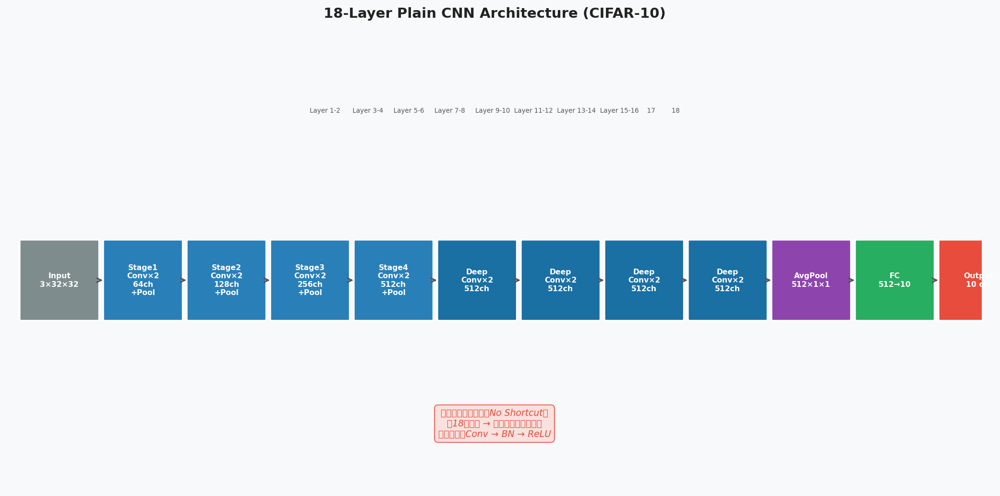
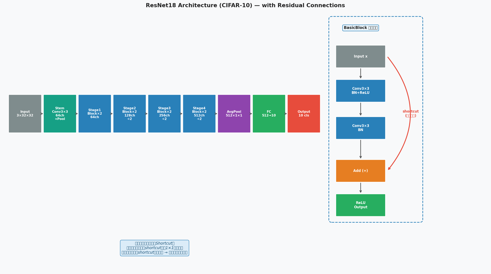
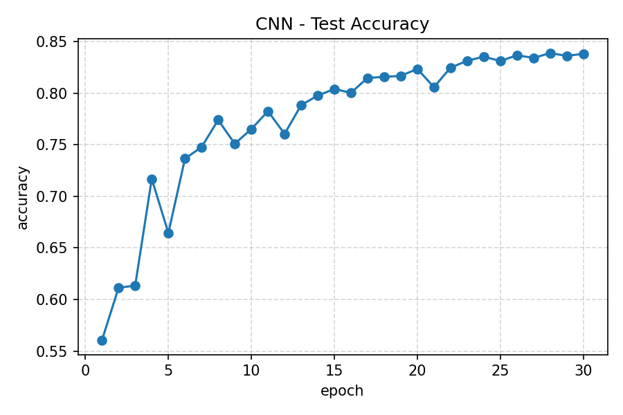
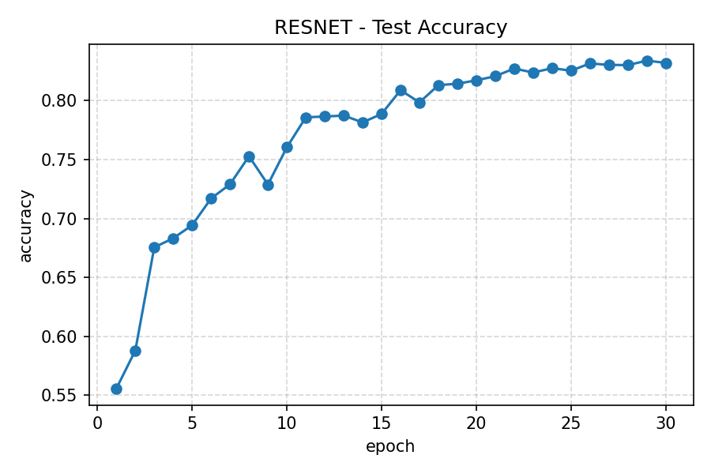
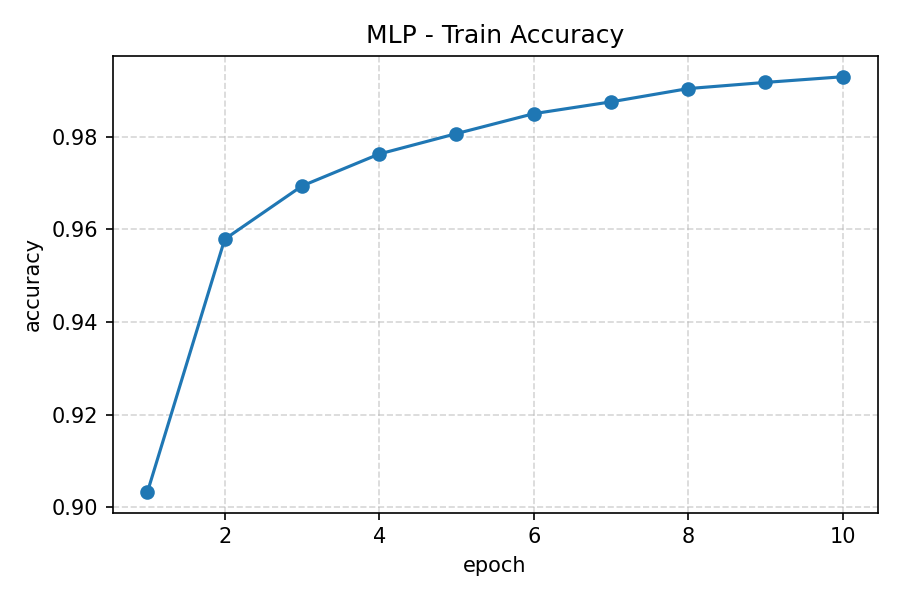
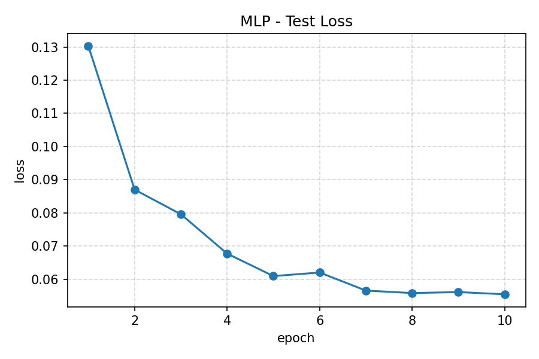
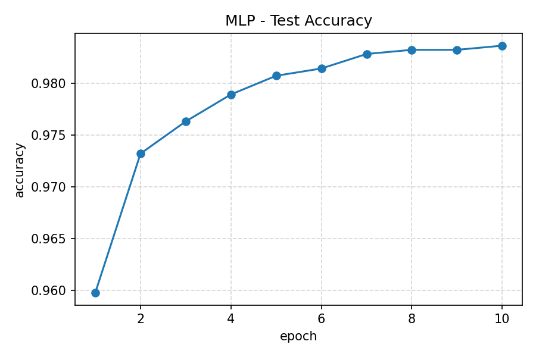
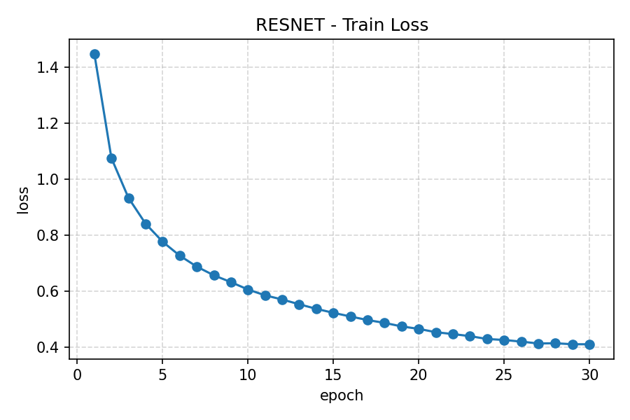
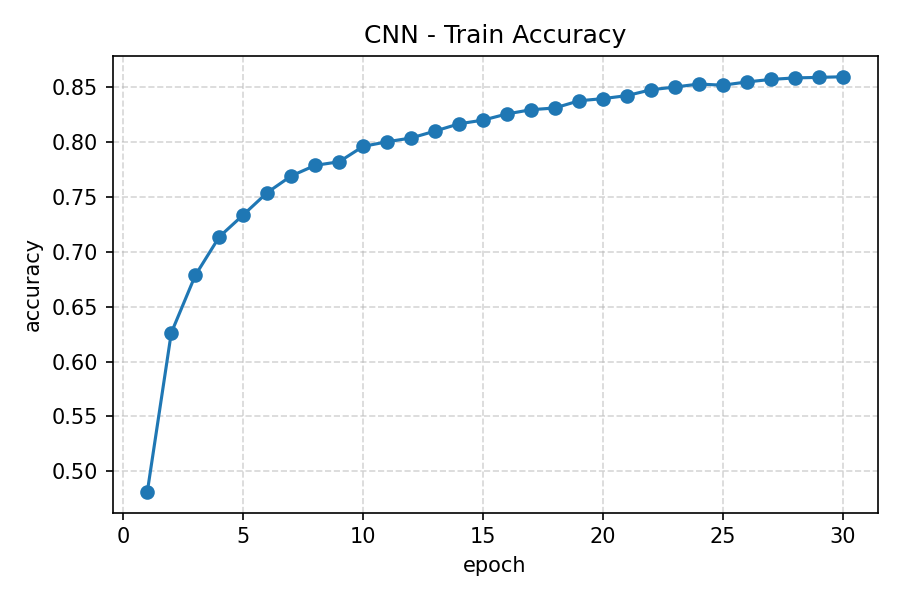
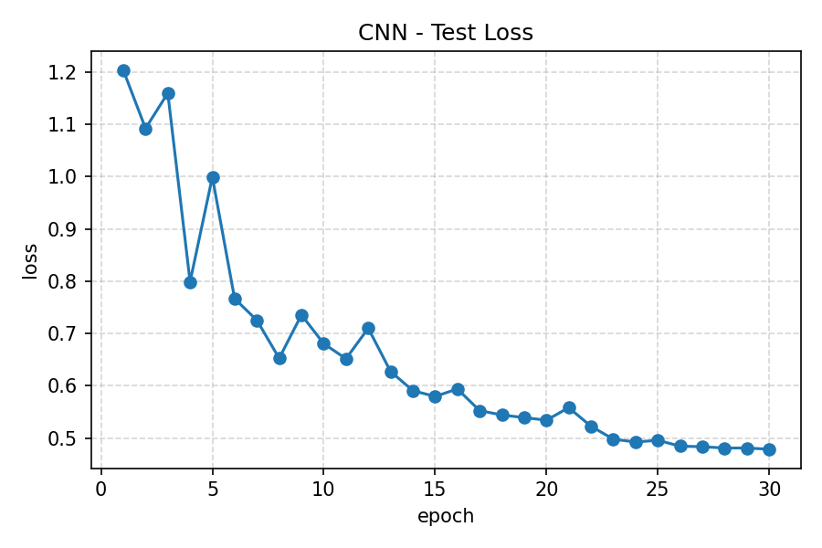

# DeepLearningBasicModels

A from-scratch PyTorch implementation of six classic deep learning architectures — MLP, CNN, ResNet variants, and Bi-GRU — spanning image classification and sentiment analysis, with a controlled experiment comparing 18-layer Plain CNN and ResNet18 on CIFAR-10.

## ⚡ At a Glance

| Phase | Model        | Dataset  | Task                 | Test Accuracy |
| ----- | ------------ | -------- | -------------------- | ------------- |
| 1     | MLP          | MNIST    | Digit Classification | 98.36%        |
| 1     | CNN          | CIFAR-10 | Image Classification | 83.88%        |
| 1     | MiniResNet   | CIFAR-10 | Image Classification | 83.40%        |
| 1     | Bi-GRU       | IMDB     | Sentiment Analysis   | 89.08%        |
| 2     | Plain CNN-18 | CIFAR-10 | Image Classification | 93.95%        |
| 2     | ResNet18     | CIFAR-10 | Image Classification | 93.25%        |

## 📖 Project Motivation & Story

This project covers a full implementation cycle of six classic deep learning architectures in PyTorch, spanning model definition, training pipeline construction, and systematic result analysis across two task domains: image classification and sentiment analysis.

**Phase 1** reproduced four foundational models — MLP on MNIST, CNN and MiniResNet on CIFAR-10, and Bi-GRU on IMDB — establishing a complete and reusable experimental framework. A notable observation emerged from this phase: **MiniResNet (6-layer) showed no clear accuracy advantage over the plain CNN on CIFAR-10(83.40%vs.83.88%).** At only 6 layers, gradient vanishing is not a  significant factor, and the plain CNN's larger parameter count likely compensated for the absence of residual connections. The architectural conditions under which residual connections are expected to matter did not sufficiently exist at this depth.

This observation motivated **Phase 2**: a controlled experiment examining whether the advantage of residual connections becomes apparent at greater depth. An 18-layer Plain CNN and a standard ResNet18 were constructed and trained under 
identical conditions on CIFAR-10. The two architectures differ not only in the presence of residual connections, but also substantially in parameter count (~23.6M vs. ~11.2M) — a asymmetry that itself becomes a meaningful variable in interpreting the results.

The results were more nuanced than a direct accuracy comparison would suggest. Plain CNN-18 achieved marginally higher final test accuracy (93.95% vs. 93.25%), yet gradient analysis revealed a more informative picture. Plain CNN maintained slightly higher gradient norms for approximately the first 150 epochs, after which ResNet18's gradient norms surpassed it — consistent with progressive gradient saturation in the deeper plain network. Throughout training, ResNet18 exhibited consistently lower gradient norm standard deviation per epoch, indicating more balanced gradient flow across layers. This stability was further reflected in per-epoch test accuracy: ResNet18's evaluation results showed 
markedly lower variance across training, despite its marginally lower peak accuracy.

These findings suggest that on CIFAR-10, the parameter count asymmetry and the dataset's limited complexity prevent ResNet18 from demonstrating a clear accuracy advantage. Nevertheless, the gradient dynamics provide concrete evidence that residual connections produce more stable and well-distributed gradient flow — the property that underlies ResNet's documented advantages at greater depths and on more complex tasks.

## 🧠 Model Architectures

### Phase 1 — Four Classic Models

Four standard architectures are implemented across two task domains, each trained and evaluated independently.

| Model      | Dataset  | Input              | Key Mechanism                 | Parameters |
| ---------- | -------- | ------------------ | ----------------------------- | ---------- |
| MLP        | MNIST    | `(1, 28, 28)`      | Fully-connected + Dropout     | 235K       |
| CNN        | CIFAR-10 | `(3, 32, 32)`      | Conv-BN-ReLU blocks + MaxPool | 73K        |
| MiniResNet | CIFAR-10 | `(3, 32, 32)`      | BasicBlock + skip connections | 76K        |
| Bi-GRU     | IMDB     | `(B, T)` token ids | Bidirectional GRU + Embedding | ~3.6M      |

---

#### MLP (MNIST)


Two hidden layers with ReLU activation and Dropout regularization. Despite its simplicity, the architecture achieves **98.36% test accuracy** on MNIST — demonstrating that fully-connected networks remain effective on low-complexity image tasks.

> 85% of all parameters reside in the first linear layer (784→256)，illustrating the fundamental inefficiency of MLPs on spatial data.

---

#### CNN (CIFAR-10)


Three blocks of paired 3×3 convolutions (channels: 3→16→32→64), each followed by MaxPool downsampling. Global average pooling replaces a large FC head, keeping the classifier to a single Linear(64→10) layer.

| Block      | Channels     | Output Shape   | Params |
| ---------- | ------------ | -------------- | ------ |
| Block 1    | 3 → 16 → 16  | `(16, 16, 16)` | 2,800  |
| Block 2    | 16 → 32 → 32 | `(32, 8, 8)`   | 13,952 |
| Block 3    | 32 → 64 → 64 | `(64, 4, 4)`   | 55,552 |
| Classifier | GAP + FC     | `(10,)`        | 650    |

> With only 73K parameters — roughly 3× fewer than the 2-layer MLP — the CNN demonstrates the parameter efficiency gained through convolutional weight sharing.

---

#### MiniResNet (CIFAR-10)


Structurally identical to the CNN above, with each convolutional pair replaced by a **BasicBlock** incorporating a skip connection. When input and output channels differ, the shortcut uses a 1×1 convolution for dimension alignment.

x ──→ Conv3×3 → BN → ReLU → Conv3×3 → BN ──→ (+) → ReLU
└──────────── shortcut (identity / 1×1 Conv) ──┘

The skip connection adds only **2,832 parameters (+3.9%)** over the plain CNN, yet provides a direct gradient pathway through each block.

> On CIFAR-10, MiniResNet achieves **83.40%** vs. CNN's **83.88%** — no clear advantage at 6 layers, where gradient vanishing is not yet a significant factor. This observation directly motivated the 18-layer comparison in Phase 2.

---

#### Bi-GRU (IMDB)


A 2-layer bidirectional GRU for binary sentiment classification. The final hidden states from both directions are concatenated to form a fixed-length sentence representation, followed by Dropout and a linear classifier.

Embedding(vocab→128) → BiGRU(hidden=128) × 2 layers→ Concat(h_fwd, h_bwd) → (B, 256) → Dropout → Linear(256→2)

| Component                  | Parameters | Share |
| -------------------------- | ---------- | ----- |
| Embedding (vocab=25K)      | ~3,200,000 | ~88%  |
| GRU layers (×4 directions) | 428,544    | ~12%  |
| Classifier FC              | 514        | <0.1% |

> The embedding table accounts for ~88% of total parameters — a characteristic of NLP models with large vocabularies. Bidirectionality is essential here: sentiment often depends on global sentence context rather than local patterns.

### Phase 2 — 18-Layer Controlled Experiment

Phase 2 constructs a direct architectural comparison to examine the effect of residual connections at depth. Both models share identical channel progressions (`3→64→128→256→512`) and spatial downsampling schedules, but differ in
structural design and total parameter count.

|                        | PlainCNN-18     | ResNet18                 |
| ---------------------- | --------------- | ------------------------ |
| **Parameters**         | **23.57M**      | **11.17M**               |
| Skip connections       | ✗               | ✓ (8 BasicBlocks)        |
| Downsampling           | MaxPool         | stride=2 inside block    |
| Deepest unbroken chain | 16 conv layers  | ~2 conv layers per block |
| Parameter hotspot      | Stage 5 — 80.1% | Stage 4 — 75.1%          |

---

#### PlainCNN-18



Stages 1–4 follow a standard doubling pattern (channels ×2, spatial ÷2 at each stage). Stage 5 then stacks 8 additional Conv(512→512) layers on a fixed 2×2 feature map — no shortcut, no downsampling.

| Stage       | Structure                               | Output Shape   | Parameters     | % Total   |
| ----------- | --------------------------------------- | -------------- | -------------- | --------- |
| Stage 1     | Conv(3→64) + Conv(64→64) + MaxPool      | `(64, 16, 16)` | 38,848         | 0.2%      |
| Stage 2     | Conv(64→128) + Conv(128→128) + MaxPool  | `(128, 8, 8)`  | 221,696        | 0.9%      |
| Stage 3     | Conv(128→256) + Conv(256→256) + MaxPool | `(256, 4, 4)`  | 885,760        | 3.8%      |
| Stage 4     | Conv(256→512) + Conv(512→512) + MaxPool | `(512, 2, 2)`  | 3,540,992      | 15.0%     |
| **Stage 5** | **8 × Conv(512→512)**                   | `(512, 2, 2)`  | **18,882,560** | **80.1%** |
| Classifier  | GAP + Linear(512→10)                    | `(10,)`        | 5,130          | <0.1%     |
| **Total**   |                                         |                | **23,574,986** |           |

> Stage 5 alone accounts for 80% of all parameters, yet operates on a 2×2 feature map with no shortcut to mitigate vanishing gradients across its 8 sequential layers.

---

#### ResNet18



Replaces every convolutional pair with a **BasicBlock**. When channel dimensions change across stages, the shortcut uses a 1×1 convolution for alignment; otherwise it is a parameter-free identity mapping.

x ──→ Conv3×3 → BN → ReLU → Conv3×3 → BN ──→ (+) → ReLU
└────────── shortcut (Identity or Conv1×1+BN) ──┘

| Stage       | Structure                      | Output Shape   | Parameters     | % Total   |
| ----------- | ------------------------------ | -------------- | -------------- | --------- |
| Stem        | Conv(3→64, k=3) + MaxPool      | `(64, 16, 16)` | 1,856          | <0.1%     |
| Stage 1     | 2× BasicBlock(64→64)           | `(64, 16, 16)` | 147,968        | 1.3%      |
| Stage 2     | BB(64→128, s=2) + BB(128→128)  | `(128, 8, 8)`  | 525,568        | 4.7%      |
| Stage 3     | BB(128→256, s=2) + BB(256→256) | `(256, 4, 4)`  | 2,099,712      | 18.8%     |
| **Stage 4** | BB(256→512, s=2) + BB(512→512) | `(512, 2, 2)`  | **8,393,728**  | **75.1%** |
| Classifier  | GAP + Linear(512→10)           | `(10,)`        | 5,130          | <0.1%     |
| **Total**   |                                |                | **11,173,962** |           |

> Shortcut parameters total only 173,824 —**1.6% of ResNet18's parameter budget** — yet they fundamentally alter the gradient flow through every block.

## ⚙️ Training Configuration

### Phase 1 — Four Classic Models

All four models are trained with **Adam optimizer** and **CosineAnnealingLR** scheduler. Each model uses **CrossEntropyLoss** as the objective.

|               | MLP               | CNN               | MiniResNet        | Bi-GRU            |
| ------------- | ----------------- | ----------------- | ----------------- | ----------------- |
| Dataset       | MNIST             | CIFAR-10          | CIFAR-10          | IMDB              |
| Optimizer     | Adam              | Adam              | Adam              | Adam              |
| Learning rate | 1e-3              | 1e-3              | 1e-3              | 1e-3              |
| Weight decay  | —                 | 5e-4              | 5e-4              | —                 |
| Scheduler     | CosineAnnealingLR | CosineAnnealingLR | CosineAnnealingLR | CosineAnnealingLR |
| Batch size    | 128               | 128               | 128               | 64                |
| Epochs        | 10                | 30                | 30                | 8                 |
| Loss          | CrossEntropy      | CrossEntropy      | CrossEntropy      | CrossEntropy      |

**Data preprocessing:**

| Dataset  | Training Augmentation                        | Normalization                                               |
| -------- | -------------------------------------------- | ----------------------------------------------------------- |
| MNIST    | None                                         | mean=0.1307, std=0.3081                                     |
| CIFAR-10 | RandomCrop(32, pad=4) + RandomHorizontalFlip | mean=(0.4914, 0.4822, 0.4465), std=(0.2470, 0.2435, 0.2616) |
| IMDB     | —                                            | Vocabulary: top 20K words, min\_freq=2, max\_len=256        |

---

### Phase 2 — 18-Layer Comparison

Both models are trained under **identical conditions**. The sole structural difference is the presence or absence of residual connections.

| Configuration         | Value                                                       |
| --------------------- | ----------------------------------------------------------- |
| Optimizer             | SGD, momentum=0.9, weight\_decay=5e-4                       |
| Initial learning rate | 0.1                                                         |
| Scheduler             | CosineAnnealingLR (T\_max=200, eta\_min=1e-4)               |
| Batch size            | 128                                                         |
| Epochs                | 200                                                         |
| Loss                  | CrossEntropy                                                |
| Data augmentation     | RandomCrop(32, pad=4) + RandomHorizontalFlip                |
| Normalization         | mean=(0.4914, 0.4822, 0.4465), std=(0.2023, 0.1994, 0.2010) |

SGD with momentum is used instead of Adam for Phase 2, as it is better suited to the cosine annealing schedule and more closely reflects standard ResNet training practice. The 200-epoch budget provides sufficient convergence time for
both architectures under the slower-decaying cosine schedule.

**Gradient norm tracking:** During each training batch, the L2 norm of all parameter gradients is computed after `loss.backward()` and before`optimizer.step()`. The per-epoch mean and standard deviation of these batch-level norms are recorded throughout training, producing a quantitative measure of gradient flow dynamics for both models.  This data is used in the gradient analysis section below.

## 📊 Results & Analysis

### Phase 1 — Baseline Results

| Model      | Dataset  | Test Accuracy |
| ---------- | -------- | ------------- |
| MLP        | MNIST    | 98.36%        |
| CNN        | CIFAR-10 | 83.88%        |
| MiniResNet | CIFAR-10 | 83.40%        |
| Bi-GRU     | IMDB     | 89.08%        |

The CNN and MiniResNet results on CIFAR-10 are particularly noteworthy: despite MiniResNet incorporating residual connections, it shows no accuracy advantage over the plain CNN (83.40% vs. 83.88%). Both curves converge steadily within 30 epochs, with no sign of degradation in either model — consistent with the expectation that at only 6 layers, gradient vanishing is not yet a limiting factor.

<p align="center">
  
  
</p>
<p align="center"><em>Test accuracy curves: CNN (left) vs. MiniResNet (right) on CIFAR-10, 30 epochs.</em></p>

<details>
<summary>📂 All Phase 1 training curves (click to expand)</summary>

|            | MLP                                                          | Bi-GRU                                                       |
| ---------- | ------------------------------------------------------------ | ------------------------------------------------------------ |
| Train Loss |  |  |
| Train Acc  |  |  |
| Test Loss  |  |  |
| Test Acc   |  |  |

|            | CNN                                                          | MiniResNet                                                   |
| ---------- | ------------------------------------------------------------ | ------------------------------------------------------------ |
| Train Loss |  |  |
| Train Acc  |  |  |
| Test Loss  |  |  |

</details>

---

### Phase 2 — 18-Layer Comparison

#### Accuracy & Loss

| Model        | Parameters | Best Test Accuracy |
| ------------ | ---------- | ------------------ |
| Plain CNN-18 | ~23.5M     | **93.95%**         |
| ResNet18     | ~11.2M     | **93.25%**         |

<p align="center">
  
  
</p>
<p align="center"><em>Training and test Loss (left) and Accuracy (right): Plain CNN-18 vs. ResNet18, 200 epochs.</em></p>

Plain CNN-18 achieves marginally higher final test accuracy (+0.70%), yet ResNet18's test accuracy curve exhibits notably lower per-epoch variance throughout training — a concrete indicator of more stable optimization.

#### Per-Class Accuracy

<p align="center">
  
</p>
<p align="center"><em>Per-class test accuracy on CIFAR-10: Plain CNN-18 vs. ResNet18.</em></p>

#### Gradient Norm Analysis

<p align="center">
  
</p>
<p align="center"><em>Gradient norm dynamics across 200 epochs: epoch mean, standard deviation,
and box plot distribution.</em></p>
Plain CNN-18 maintains higher gradient norms for approximately the first 150 epochs. After epoch 150, ResNet18's gradient norms surpass those of Plain CNN-18 — consistent with progressive gradient saturation in the deeper plain
network during late training. Throughout all 200 epochs, ResNet18 exhibits consistently lower gradient norm standard deviation per epoch, indicating more balanced and uniform gradient flow across layers.

<details>
<summary>📂 Individual test outputs — confusion matrices, confidence distributions,
prediction samples (click to expand)</summary>

**Confusion Matrices**
<p>
  
  
</p>

**Per-Class Accuracy**
<p>
  
  
</p>

**Confidence Distributions**
<p>
  
  
</p>

**Prediction Samples** (green = correct, red = incorrect)
<p>
  
  
</p>

</details>

<details>
<summary>📂 Full training curves — loss, accuracy, learning rate schedules
(click to expand)</summary>

|             | Plain CNN-18                                                 | ResNet18                                                     |
| ----------- | ------------------------------------------------------------ | ------------------------------------------------------------ |
| Loss        |  |  |
| Accuracy    |  |  |
| LR Schedule |  |  |

</details>

## 🔍 Experiment Analysis

### Why Does Plain CNN-18 Still Outperform ResNet18 on CIFAR-10?

The final accuracy gap (93.95% vs. 93.25%) appears to contradict the established narrative that residual connections improve deep network performance. Four factors collectively explain this outcome.

---

#### 1. Parameter Count Asymmetry

Plain CNN-18 contains approximately 23.6M parameters, compared to ResNet18's 11.2M — a 2.1× difference driven almost entirely by Stage 5, which stacks 8 Conv(512→512) layers on a fixed 2×2 feature map and accounts for 80% of Plain CNN-18's total parameter budget. On CIFAR-10, which contains only 50,000 training images across 10 classes, a model with 23.6M parameters has substantially greater capacity to fit the training distribution. Under these conditions, parameter volume alone can compensate for architectural inefficiency, masking the structural advantage that residual connections provide.

---

#### 2. Gradient Norm Does Not Equal Gradient Health

Plain CNN-18 maintains higher total gradient norms for the first ~150 epochs, which might superficially suggest stronger learning signal. However, the total gradient norm is the L2 norm aggregated across all parameters — a quantity that scales naturally with parameter count. A model with 2.1× more parameters will produce a larger total norm even if its deep layers receive negligible gradients. The more informative signal is the **gradient norm standard deviation per
epoch**: ResNet18 exhibits consistently lower std throughout all 200 epochs, indicating that gradient magnitudes are more uniform across batches and layers. Furthermore, after epoch 150, ResNet18's mean gradient norm surpasses that of Plain CNN-18 — consistent with the interpretation that Plain CNN-18's gradients begin to saturate in the later stages of training, while ResNet18's shortcut connections maintain a direct gradient pathway through every block, sustaining
healthy gradient flow to the end of training.

---

#### 3. Task Complexity Limits ResNet18's Advantage

The residual connection was designed to address the **degradation problem** observed in networks deeper than ~20 layers trained on large-scale datasets such as ImageNet. On CIFAR-10, two factors reduce the severity of this problem. First, Batch Normalization — applied after every convolutional layer in both models — already partially mitigates gradient vanishing on this relatively simple task. Second, at 18 layers, both architectures remain within a depth regime where plain networks can still train effectively with BN, leaving less room for residual connections to demonstrate a decisive advantage. The 0.70% accuracy gap is small precisely because BN has already addressed much of the problem that ResNet was designed to solve.

---

#### 4. What This Experiment Actually Proves

The absence of a large accuracy gap does not undermine the experiment's conclusions — it contextualizes them. Three findings remain robust:

- **Parameter efficiency**: ResNet18 achieves 93.25% accuracy with only 11.2M parameters, compared to Plain CNN-18's 93.95% with 23.6M. Normalizing for parameter count, ResNet18 is the substantially more efficient architecture.
- **Training stability**: ResNet18's per-epoch test accuracy variance is markedly lower throughout training, reflecting more consistent optimization behavior — a property that becomes critical when deploying models in
  practice.
- **Gradient flow health**: The late-training gradient norm reversal, combined with ResNet18's lower gradient std across all epochs, provides direct empirical evidence that residual connections produce more stable and
  well-distributed gradient flow — the fundamental mechanism underlying ResNet's documented advantages at greater depths and on more complex tasks.

## 🚀 How to Run

### Requirements

```bash
pip install -r requirements.txt
```

```
torch
torchvision
numpy
matplotlib
scikit-learn
```

### Phase 1 — Train Classic Models

```bash
# Train a single model (default epochs: MLP=10, CNN/ResNet=30, GRU=8)
python train.py --model mlp
python train.py --model cnn
python train.py --model resnet
python train.py --model gru

# Train all four models sequentially
python train.py --model all

# Override default epochs
python train.py --model cnn --epochs 50
```

Training curves are saved to `assets_former_four_models/` automatically.

### Phase 2 — 18-Layer Comparison

```bash
# Step 1: Generate architecture diagrams (no training required)
python plot_structures_v2.py

# Step 2: Train both models (recommended: GPU)
# Each run takes approximately 1–3 hours on a modern GPU
python train_v2.py --model plain
python train_v2.py --model resnet

# Step 3: Run detailed evaluation
python test.py --model plain
python test.py --model resnet

# Step 4: Generate cross-model comparison plots
python compare.py
```

All Phase 2 outputs are saved to `assets_new_two_models/` automatically.

> **Note:** Phase 2 training is computationally intensive. CPU execution is
> not recommended for `train_v2.py`. Training was conducted on CUDA 12.4.

---

## 📁 Project Structure

```
DeepLearningBasicModels/
│
├── models/
│   ├── mlp.py                    # MLP: 2-hidden-layer perceptron (MNIST)
│   ├── cnn.py                    # CNN: 6-layer, 3-block (CIFAR-10)
│   ├── resnet.py                 # MiniResNet: 3 BasicBlocks (CIFAR-10)
│   ├── gru.py                    # Bi-GRU: 2-layer bidirectional (IMDB)
│   ├── plain_cnn_18layer.py      # PlainCNN-18: 18-layer no residual (CIFAR-10)
│   └── resnet18_cifar10.py       # ResNet18: standard residual (CIFAR-10)
│
├── assets_former_four_models/    # Training curves for Phase 1 models
├── assets_new_two_models/        # All plots for Phase 2 models
├── model_structures/             # Architecture diagrams (all 6 models)
├── checkpoints_new_two_models/   # Saved weights: best_plain_cnn.pth,
│                                 #   best_resnet18.pth
│
├── train.py                      # Phase 1 unified training script
├── train_v2.py                   # Phase 2 training with gradient tracking
├── test.py                       # Phase 2 detailed evaluation script
├── compare.py                    # Phase 2 cross-model comparison script
├── data_utils.py                 # Data loading for Phase 1 (MNIST/CIFAR-10/IMDB)
├── data_utils_v2.py              # Data loading for Phase 2 (CIFAR-10)
├── plot_structures.py            # Architecture diagram generator (Phase 1)
├── plot_structures_v2.py         # Architecture diagram generator (Phase 2)

├── requirements.txt
├── .gitignore
└── README.md
```

---

## 💡 Key Takeaways

- **Convolution over fully-connected layers**: The 6-layer CNN achieves comparable accuracy to the 2-layer MLP on image tasks with 2× fewer parameters, demonstrating the practical impact of spatial weight sharing.
  
- **Residual connections require sufficient depth**: MiniResNet (6 layers) shows no accuracy advantage over the plain CNN — skip connections address gradient vanishing, a problem that does not yet manifest at shallow depths. This observation directly motivated the 18-layer controlled experiment.
  
- **Parameter efficiency over raw accuracy**: ResNet18 matches Plain CNN-18's performance (93.25% vs. 93.95%) using only 47% of its parameters. On larger datasets or deeper architectures, this efficiency advantage is expected to translate into a decisive accuracy gap.
  
- **Gradient dynamics as a diagnostic tool**: Tracking per-batch gradient norms throughout training reveals behavioral differences invisible to accuracy metrics alone — ResNet18's lower gradient std and late-training norm reversal provide direct empirical evidence of healthier gradient flow, independent of final accuracy.
